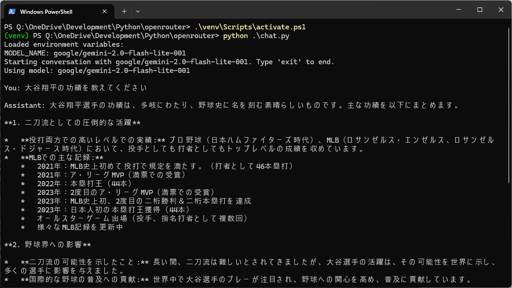
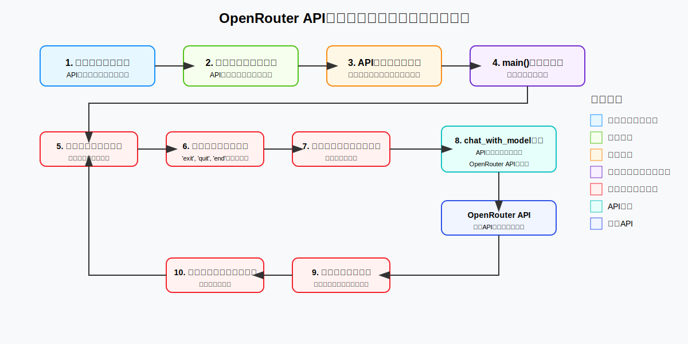

# OpenRouter チャットアプリケーション

OpenRouterのAPIを使用して様々なAIモデル（Gemini、Claude、GPTなど）と会話するためのシンプルなPythonアプリケーションです。

## 機能
<br>
- OpenRouterのAPIを通じてAIモデルと対話
- 環境変数を使用したAPIキーとモデル名の管理
- シンプルなコマンドラインインターフェース

## アーキテクチャ

このアプリケーションは、OpenRouter APIを通じてAIモデルとの会話を実現するためのシンプルなフローに従っています：
<br>

### システムコンポーネント

1. **初期化コンポーネント**
   - **環境変数ローダー**：.envファイルからAPIキーとモデル名を取得
   - **検証モジュール**：必要な環境変数が存在することを確認
   - **API設定**：API通信のための適切なヘッダーを設定
   - **メイン関数**：会話履歴を初期化しプログラムを開始

2. **会話ループコンポーネント**
   - **ユーザー入力ハンドラー**：ユーザーからのテキスト入力を収集・処理
   - **終了コマンドチェッカー**：プログラムを終了するための終了コマンドを監視
   - **メッセージマネージャー**：コンテキストのための会話履歴を維持
   - **API通信モジュール**：OpenRouterへのリクエストを構築・送信

3. **外部コンポーネント**
   - **OpenRouter API**：様々なAIモデルへのリクエストをルーティングする外部サービス

### データフロー

1. プログラムは環境変数のロードと検証から開始
2. 認証キーを使用してAPIヘッダーを設定
3. メイン会話ループが開始：
   - ユーザーがメッセージを入力
   - プログラムが終了コマンドかどうかをチェック
   - 終了コマンドでなければ、メッセージを会話履歴に追加
   - chat_with_model関数が会話履歴を含むAPIリクエストを構築
   - リクエストがOpenRouter APIに送信
   - APIがモデルの応答を返す
   - 応答がユーザーに表示され、会話履歴に追加
   - 次のユーザー入力のためにループが継続

このアーキテクチャにより、ユーザーと様々なAIモデル間のシンプルかつ効果的なインターフェースが実現され、OpenRouter APIがモデル選択と通信の複雑さを処理します。

## セットアップ

### 前提条件

- Python 3.12以上
- OpenRouterのアカウントとAPIキー

### インストール

1. リポジトリをクローンまたはダウンロードします

2. 仮想環境を作成します：

```bash
python -m venv venv
```

3. 仮想環境を有効化します：

Windows PowerShellの場合：
```powershell
venv\Scripts\activate.ps1
```

Windows コマンドプロンプトの場合：
```cmd
venv\Scripts\activate.bat
```

Linux/Macの場合：
```bash
source venv/bin/activate
```

4. pipを最新バージョンに更新します：

```bash
python -m pip install --upgrade pip
```

5. 必要なライブラリをインストールします：

```bash
pip install -r requirements.txt
```

### 環境変数の設定

プロジェクトには`.env.example`ファイルが含まれています。このファイルをコピーして`.env`ファイルを作成し、必要な環境変数を設定します：

1. `.env.example`ファイルを`.env`としてコピーします：

```bash
copy .env.example .env
```

2. `.env`ファイルを開き、以下の環境変数を設定します：

```
OPENROUTER_API_KEY=<YOUR_API_KEY>
# The following LLMs have good response accuracy.
#MODEL_NAME=anthropic/claude-3.7-sonnet
#MODEL_NAME=openai/o1-mini-2024-09-12
# The following LLMs have fast response speeds.
MODEL_NAME=google/gemini-2.0-flash-lite-001
```

- `OPENROUTER_API_KEY`: OpenRouterから取得したAPIキーを入力します
- `MODEL_NAME`: 使用したいモデルの名前を選択します。コメントアウトされているモデルを使用する場合は、使用したいモデルのコメントを外し、他のモデルをコメントアウトしてください

OpenRouterで利用可能なモデルの一覧は[OpenRouterのウェブサイト](https://openrouter.ai/docs#models)で確認できます。

## 使用方法

プログラムを実行するには：

```bash
python chat.py
```

- 会話を開始するとプロンプトが表示されます
- メッセージを入力してEnterキーを押すと、AIモデルからの応答が表示されます
- 会話を終了するには `exit`、`quit`、または `終了` と入力します

## 注意事項

- APIリクエストには料金が発生する場合があります。OpenRouterの料金体系を確認してください。
- モデルによって応答の品質や速度が異なります。

## ライセンス

このプロジェクトはMITライセンスの下で公開されています。詳細は[LICENSE.txt](LICENSE.txt)ファイルを参照してください。

```
MIT License

Copyright (c) 2025 potofo
```