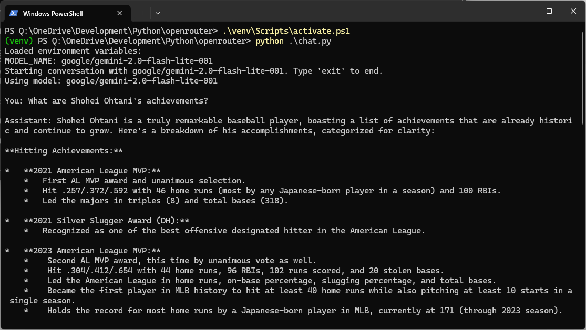
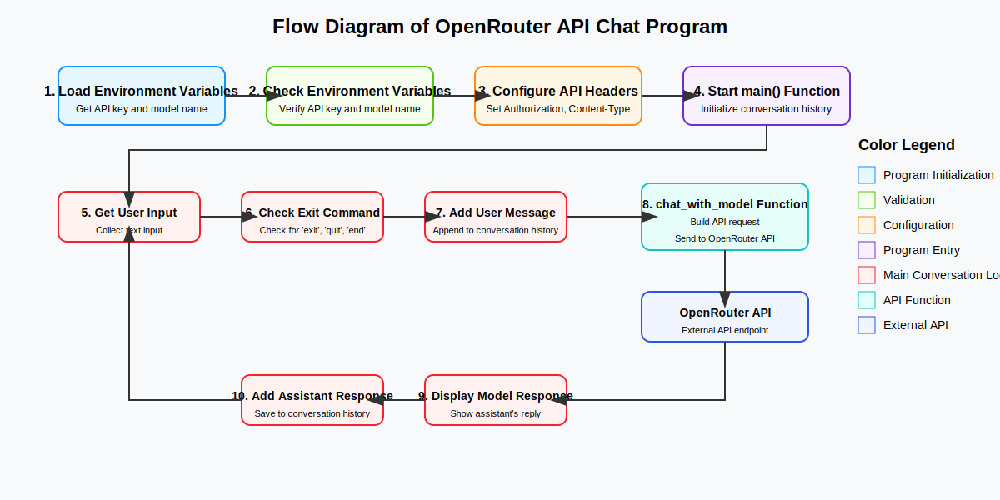

# OpenRouter Chat Application

A simple Python application for conversing with various AI models (Gemini, Claude, GPT, etc.) using the OpenRouter API.

## Features
<br>
- Interact with AI models through the OpenRouter API
- Manage API keys and model names using environment variables
- Simple command-line interface

## Architecture

The application follows a straightforward flow to facilitate conversations with AI models through the OpenRouter API:
<br>

### System Components

1. **Initialization Components**
   - **Environment Variables Loader**: Retrieves API key and model name from the .env file
   - **Validation Module**: Verifies that required environment variables are present
   - **API Configuration**: Sets up proper headers for API communication
   - **Main Function**: Initializes the conversation history and starts the program

2. **Conversation Loop Components**
   - **User Input Handler**: Collects and processes text input from the user
   - **Exit Command Checker**: Monitors for exit commands to terminate the program
   - **Message Manager**: Maintains the conversation history for context
   - **API Communication Module**: Builds and sends requests to OpenRouter

3. **External Component**
   - **OpenRouter API**: External service that routes requests to various AI models

### Data Flow

1. The program starts by loading and validating environment variables
2. API headers are configured with the authentication key
3. The main conversation loop begins:
   - User enters a message
   - The program checks if it's an exit command
   - If not, the message is added to the conversation history
   - The chat_with_model function builds an API request with the conversation history
   - The request is sent to the OpenRouter API
   - The API returns the model's response
   - The response is displayed to the user and added to the conversation history
   - The loop continues for the next user input

This architecture allows for a simple yet effective interface between the user and various AI models, with the OpenRouter API handling the complexity of model selection and communication.

## Setup

### Prerequisites

- Python 3.12 or higher
- OpenRouter account and API key

### Installation

1. Clone or download the repository

2. Create a virtual environment:

```bash
python -m venv venv
```

3. Activate the virtual environment:

For Windows PowerShell:
```powershell
venv\Scripts\activate.ps1
```

For Windows Command Prompt:
```cmd
venv\Scripts\activate.bat
```

For Linux/Mac:
```bash
source venv/bin/activate
```

4. Update pip to the latest version:

```bash
python -m pip install --upgrade pip
```

5. Install the required libraries:

```bash
pip install -r requirements.txt
```

### Setting Environment Variables

The project includes an `.env.example` file. Copy this file to create a `.env` file and set the necessary environment variables:

1. Copy the `.env.example` file as `.env`:

```bash
copy .env.example .env
```

2. Open the `.env` file and set the following environment variables:

```
OPENROUTER_API_KEY=<YOUR_API_KEY>
# The following LLMs have good response accuracy.
#MODEL_NAME=anthropic/claude-3.7-sonnet
#MODEL_NAME=openai/o1-mini-2024-09-12
# The following LLMs have fast response speeds.
MODEL_NAME=google/gemini-2.0-flash-lite-001
```

- `OPENROUTER_API_KEY`: Enter the API key obtained from OpenRouter
- `MODEL_NAME`: Select the name of the model you want to use. If you want to use one of the commented-out models, uncomment the model you want to use and comment out the other models

You can check the list of available models on OpenRouter at [OpenRouter's website](https://openrouter.ai/docs#models).

## Usage

To run the program:

```bash
python chat.py
```

- A prompt will be displayed to start the conversation
- Enter your message and press Enter to see the AI model's response
- To end the conversation, type `exit`, `quit`, or `終了` (Japanese for "exit")

## Notes

- API requests may incur charges. Please check OpenRouter's pricing structure.
- Response quality and speed may vary depending on the model.

## License

This project is released under the MIT License. See the [LICENSE.txt](LICENSE.txt) file for details.

```
MIT License

Copyright (c) 2025 potofo
```